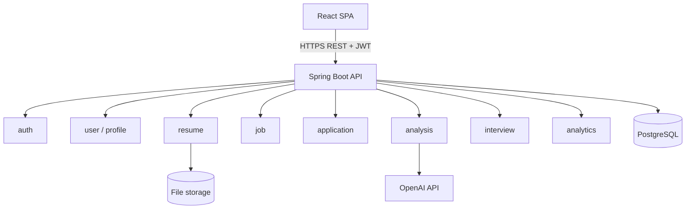

# Architecture

JobLens is a **modular monolith**: one Spring Boot deployable organised by feature, backed by PostgreSQL, serving a React single-page app.

## Principles

- Package-by-feature (`com.joblens.<feature>`); shared code lives in `common`.
- Controllers talk to services; services talk to repositories. Entities never cross the API boundary (DTOs only).
- Schema is owned by Flyway migrations; Hibernate only validates.
- Deterministic processing first (PDF text extraction, parsing); the LLM is used only for semantic analysis, and its output is schema-validated before it is stored.
- The frontend never calls OpenAI; all AI traffic goes through the backend.

## Current state

Foundation only: health/ping endpoints, stateless security config with CORS, baseline migration, and a React shell that verifies backend connectivity. Feature modules are added milestone by milestone (see [docs/PROGRESS.md](docs/PROGRESS.md)).

## Deployment

Locally the stack runs with Docker Compose (nginx, API, PostgreSQL). The AWS target is S3 + CloudFront for the web app, App Runner for the API, RDS PostgreSQL, S3 for uploads and Secrets Manager for secrets. The design, runbook and an honest list of what has and has not been verified are in [docs/DEPLOYMENT.md](docs/DEPLOYMENT.md).
