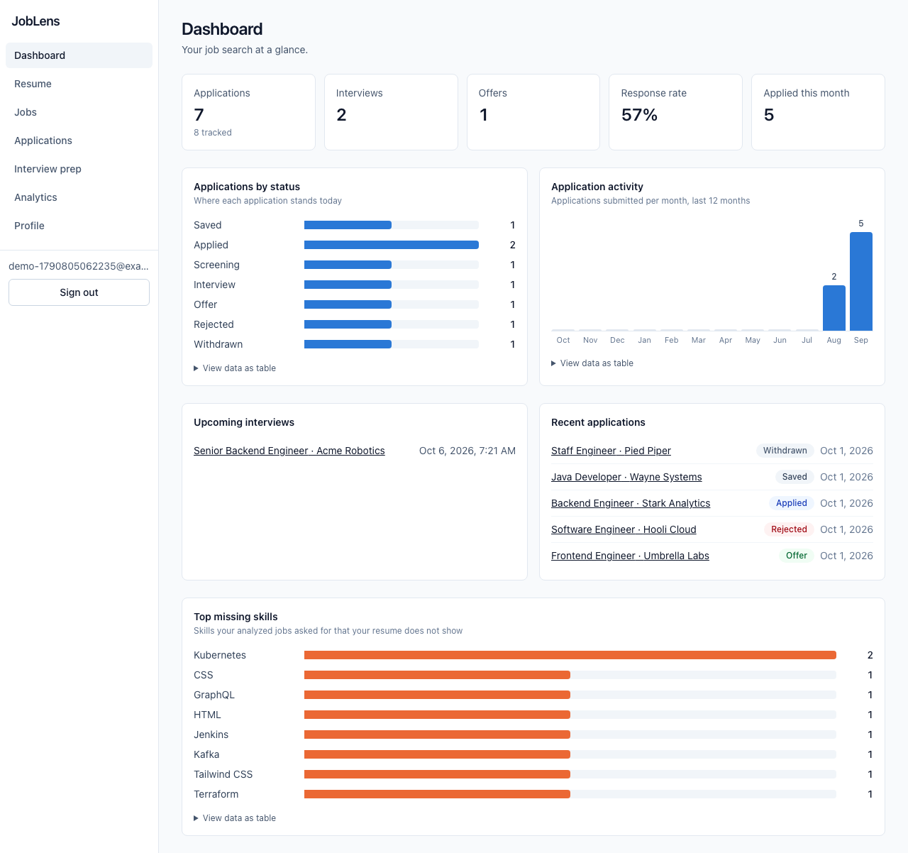
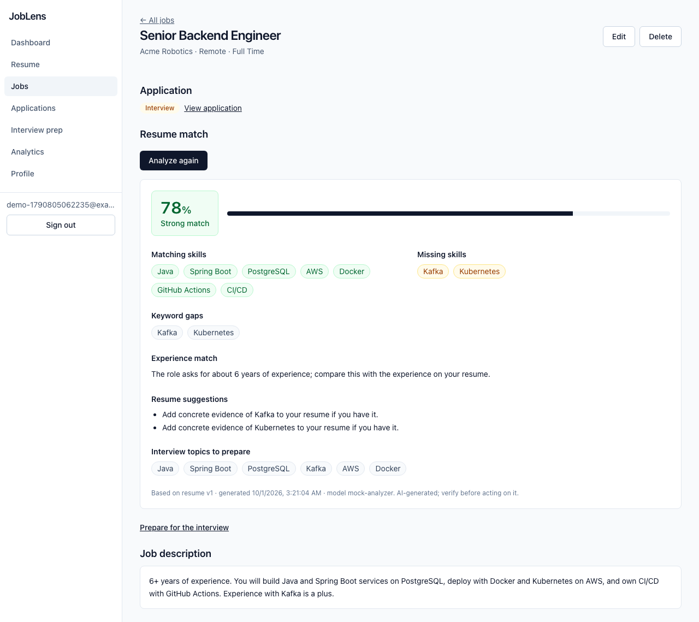
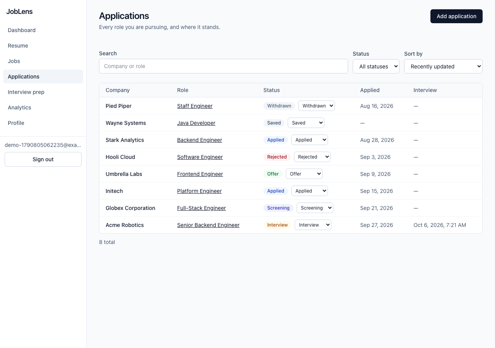
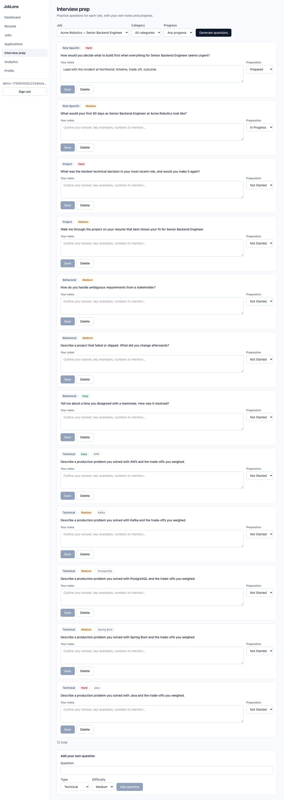
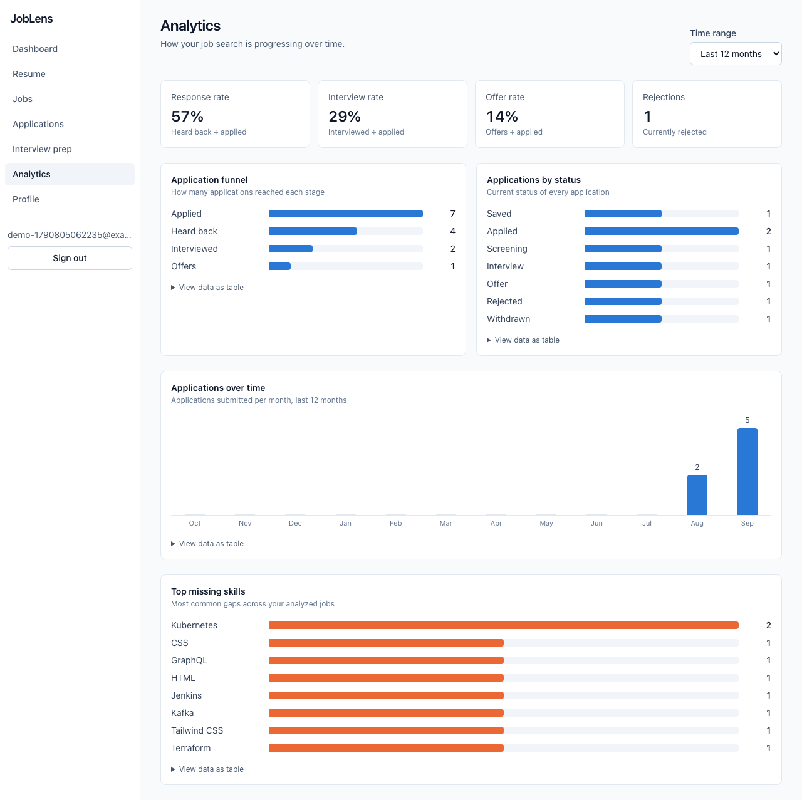
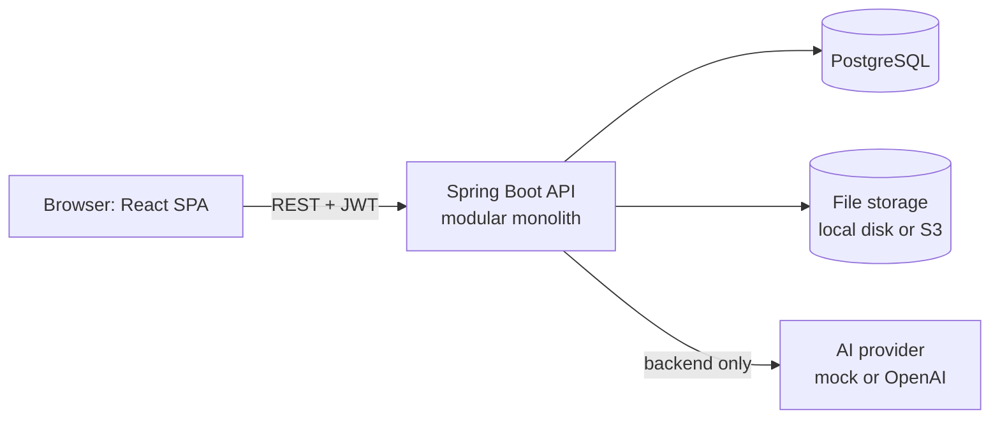

# JobLens

[](https://github.com/Nisha-Mani/joblens/actions/workflows/ci.yml)

**AI-powered job search and resume intelligence platform.** JobLens helps software engineers understand how their
experience aligns with job opportunities, identify skill gaps, improve their resumes, prepare for interviews and track
their applications.

> **Live demo:** not deployed yet. The AWS infrastructure is written and validated but has not been applied; see
> [docs/DEPLOYMENT.md](docs/DEPLOYMENT.md) for exactly what is and is not verified. Run it locally in one command below.



| | |
|---|---|
|  |  |
| Resume match analysis on a job | Application tracker |
|  |  |
| Interview preparation | Funnel and trends |

More in [docs/screenshots](docs/screenshots), including phone-sized views. All screenshots use a fictional account.

## Features

- **Accounts:** registration and login with BCrypt-hashed passwords, JWT authentication, `USER` and `ADMIN` roles, protected routes and automatic sign-out on expiry.
- **Resume:** PDF upload with layered validation, text extraction, **deterministic** parsing (name, contact details, summary, skills, experience, education, projects, certifications), versioning, and editing of anything the parser got wrong.
- **Jobs:** save roles and job descriptions; server-side search, filter, sort and pagination.
- **AI match analysis:** compares resume and job and returns a score, matching and missing skills, keyword gaps, an experience assessment, resume suggestions and interview topics, validated against a strict schema before it is stored.
- **Applications:** seven statuses, applied and interview dates, notes, a full status history, inline status changes, and server-side search, filter, sort and pagination.
- **Interview preparation:** generated technical, behavioral, project and role-specific questions, your own questions, per-question notes and preparation progress.
- **Dashboard and analytics:** response, interview and offer rates, a funnel, monthly activity, upcoming interviews and top missing skills, computed in SQL from real data.
- **Profile:** headline, experience and a skills list with proficiency.

AI is one capability, not the architecture: resume parsing, tracking and analytics involve no AI, and the AI layer runs on a free deterministic mock provider by default.

## Architecture



A single Spring Boot application organised by feature (`auth`, `user`, `profile`, `resume`, `job`, `application`, `analysis`,
`interview`, `analytics`), a React single-page app, and PostgreSQL managed by Flyway migrations. The frontend never calls
an AI provider. Full design, data model and request flows are in [ARCHITECTURE.md](ARCHITECTURE.md); every significant
decision and its trade-offs are in [DECISIONS.md](DECISIONS.md) (32 ADRs).

## Tech stack

| Layer | Technology |
|---|---|
| Frontend | React 19, TypeScript, Vite, React Router, TanStack Query, React Hook Form, Zod, Tailwind CSS |
| Backend | Java 21, Spring Boot 4, Spring Security (OAuth2 resource server, JWT), Spring Data JPA, Bean Validation, Flyway, PDFBox |
| Database | PostgreSQL 16 |
| AI | Provider interface with a deterministic mock and an OpenAI client (structured outputs) |
| Testing | JUnit 5, Mockito, Spring Boot Test, Vitest, React Testing Library, axe, Playwright |
| Delivery | Docker, Docker Compose, nginx, GitHub Actions, Terraform (AWS: S3, CloudFront, App Runner, RDS, Secrets Manager) |

## Run it

### Everything in Docker (recommended)

```bash
cp .env.example .env     # then set POSTGRES_PASSWORD and JWT_SECRET (openssl rand -hex 32)
docker compose up --build
# open http://localhost:8080  (override with FRONTEND_PORT)
```

nginx serves the built app and proxies `/api` to the backend, so the browser talks to one origin. Only the web port is
published. `docker compose down -v` also deletes the database and uploaded files.

### Local development

Prerequisites: JDK 21+, Node 20+, Docker (for PostgreSQL).

```bash
cp .env.example .env                                   # set POSTGRES_PASSWORD and JWT_SECRET
docker compose up -d postgres
for db in joblens_test joblens_e2e; do docker exec joblens-postgres-1 psql -U joblens -d joblens -c "CREATE DATABASE $db"; done

set -a; source .env; set +a
cd backend && ./mvnw spring-boot:run                   # http://localhost:8080  (Swagger UI at /swagger-ui.html)
cd frontend && npm install && npm run dev              # http://localhost:5173
```

### Configuration

| Variable | Default | Purpose |
|---|---|---|
| `POSTGRES_DB`, `POSTGRES_USER`, `POSTGRES_PASSWORD` | `joblens`, `joblens`, none | Database credentials (password required) |
| `DB_URL` | `jdbc:postgresql://localhost:5432/joblens` | JDBC URL |
| `JWT_SECRET` | none, **required** | Token signing key, at least 32 bytes; the app refuses to start without it |
| `JWT_EXPIRY_MINUTES` | `60` | Access token lifetime |
| `AI_PROVIDER` | `mock` | `mock` (free, deterministic) or `openai` |
| `OPENAI_API_KEY`, `OPENAI_MODEL` | none, `gpt-4o-mini` | Used when `AI_PROVIDER=openai` |
| `AI_TIMEOUT_SECONDS`, `AI_MAX_OUTPUT_TOKENS` | `30`, `1500` | Model call limits |
| `ANALYSIS_RATE_LIMIT_PER_HOUR` | `20` | Per-user cap on AI requests |
| `STORAGE_TYPE` | `local` | `local` or `s3` |
| `STORAGE_LOCAL_DIR` | `./data/uploads` | Upload directory for local storage |
| `S3_BUCKET`, `AWS_REGION`, `S3_ENDPOINT` | none | S3 storage (endpoint only for S3-compatible servers) |
| `MAX_UPLOAD_MB` | `5` | Resume size limit |
| `CORS_ALLOWED_ORIGINS` | `http://localhost:5173` | Allowed browser origins (empty = none) |

Secrets are never committed: `.env` is git-ignored, `.env.example` holds no real values, and the compose file contains
only `${VAR}` references.

**Using a real model:** set `AI_PROVIDER=openai` and `OPENAI_API_KEY`. The resume's skills and experience text and the
job description are sent to OpenAI; your name, email and phone are not. The OpenAI client has been tested against a
local stub server and boots cleanly without a key, but it has not been exercised against the live API.

## Testing

```bash
cd backend  && set -a && source ../.env && set +a && ./mvnw verify      # tests + JaCoCo report
cd frontend && npm run lint && npm run typecheck && npm run coverage && npm run build
cd e2e && npm install && npx playwright install chromium && npx playwright test
cd e2e && E2E_BASE_URL=http://localhost:8080 E2E_API_URL=http://localhost:8080 npx playwright test   # against Docker
```

Measured, not estimated:

| | |
|---|---|
| Backend | 246 tests; 94.9% line and 85.3% branch coverage |
| Frontend | 145 tests; 94.7% statement coverage; axe accessibility checks on 15 screens |
| End to end | 25 Playwright tests, run against dev servers and against the Docker containers, passing five consecutive runs |
| CI | 6 parallel jobs (backend, frontend, E2E, Docker, Terraform, aggregate) in about 3 minutes |

What the tests cover beyond the happy path: an authorization sweep that discovers every route and proves anonymous
access is rejected, cross-user isolation on every resource, concurrent requests on the places that could race (one of
which found and fixed a real bug), expired, forged and tampered tokens, malformed and oversized input, and every AI
failure mode (timeout, throttling, unusable output, missing key, rate limit). AI tests never call a paid API.
Performance measurements and their conditions are in [docs/PERFORMANCE.md](docs/PERFORMANCE.md).

## Documentation

| | |
|---|---|
| [ARCHITECTURE.md](ARCHITECTURE.md) | System design, data model, key flows |
| [DECISIONS.md](DECISIONS.md) | 32 architecture decision records |
| [API.md](API.md) | Endpoint reference (generated from OpenAPI) |
| [SECURITY.md](SECURITY.md) | Security model, AI data handling, reporting |
| [docs/DEPLOYMENT.md](docs/DEPLOYMENT.md) | AWS architecture, runbook, verification status |
| [docs/PERFORMANCE.md](docs/PERFORMANCE.md) | Measured latency, query plans, bundle size |
| [docs/PORTFOLIO.md](docs/PORTFOLIO.md) | Project summary, resume bullets, interview preparation |
| [CONTRIBUTING.md](CONTRIBUTING.md) | Workflow and conventions |

## Limitations

- **Not deployed.** AWS infrastructure is prepared and statically validated only.
- Resume parsing is heuristic: unusual layouts can yield missing or merged entries (you can correct them). Scanned, image-only and password-protected PDFs are rejected; there is no OCR.
- The live OpenAI integration is untested against the real API; everything else about AI is tested with the mock provider and a stub server.
- The mock analysis is a deterministic skill comparison, not a language model, so its scores are illustrative.
- The AI rate limit is per instance and held in memory.
- The access token is stored in `localStorage` (documented trade-off, ADR-009); there is no refresh-token flow or token revocation.
- No email verification or password reset, and no admin UI (only an admin-only API route).
- Substring search is not indexed; it is fast at the measured volume but would need `pg_trgm` for very large accounts.

## Future improvements

httpOnly-cookie sessions with refresh tokens; password reset and email verification; OCR for scanned resumes;
`pg_trgm` search; a shared rate limiter for multi-instance deployment; restricting the App Runner origin to CloudFront;
a custom domain; caching of identical analyses to cut AI cost; and a live-API smoke test for the OpenAI client.
