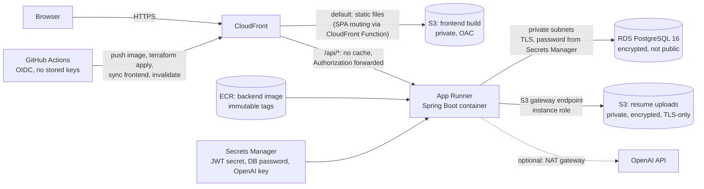

# Deployment (AWS)

> **Status: prepared, not deployed.** The infrastructure code and workflow below were written and statically
> validated, but they have **not** been applied to an AWS account, so there is no live URL yet. The
> [verification matrix](#what-has-and-has-not-been-verified) says exactly what has been proven.

## Architecture



| Concern | Choice | Why |
|---|---|---|
| Frontend | S3 + CloudFront | Static files need no servers; CloudFront gives TLS, compression and global caching. |
| API | App Runner | One container, managed TLS and scaling, far less to operate than ECS or Kubernetes. |
| One origin | CloudFront routes `/api/*` to App Runner | Same design as the Docker setup: no CORS and no API URL baked into the JavaScript bundle. |
| Database | RDS PostgreSQL 16 | Matches local and CI; private subnets, encrypted, automated backups. |
| Files | S3 behind the `FileStorage` interface | Selected with `STORAGE_TYPE=s3`; the code is unchanged. |
| Secrets | Secrets Manager | Injected into the container at start-up; the DB password is RDS-managed and never appears in code or plans. |
| Deploy auth | GitHub OIDC | Short-lived credentials limited to this repository's `production` environment. |

Kubernetes is deliberately not used: one stateless container does not need an orchestrator, and knowing when
not to reach for one is part of the design.

## Running it

Prerequisites: an AWS account (a dedicated one is recommended), the AWS CLI, Terraform 1.6+.

1. **Bootstrap once** (state bucket, GitHub OIDC provider, deploy role):
   ```bash
   cd infra/bootstrap && terraform init && terraform apply
   ```
   Note the outputs `state_bucket` and `deploy_role_arn`.
2. **Create the `production` environment** in the GitHub repository settings and add required reviewers if you
   want a manual approval gate.
3. **Set repository variables** (Settings → Secrets and variables → Actions → Variables):
   `AWS_DEPLOY_ROLE_ARN`, `AWS_REGION`, `TF_STATE_BUCKET`, `ECR_REPOSITORY` (`joblens-prod-backend`).
   Optional: `AI_PROVIDER` (`mock` or `openai`), `ENABLE_NAT_GATEWAY`. For OpenAI also add the secret `OPENAI_API_KEY`.
4. **First deployment needs two passes**, because App Runner cannot be created before an image exists in ECR:
   ```bash
   cd infra/terraform
   cp backend.hcl.example backend.hcl && cp terraform.tfvars.example terraform.tfvars   # edit both
   terraform init -backend-config=backend.hcl
   terraform apply -target=aws_ecr_repository.backend          # 1. create the registry
   # push an image tagged with a git SHA (the Deploy workflow does this for you), then:
   terraform apply                                             # 2. everything else
   ```
   After the first time, run **Actions → Deploy → Run workflow**: it refuses a commit whose CI has not passed,
   builds and pushes the image, applies Terraform, publishes the frontend and smoke-tests the live site.
5. The `site_url` output is the public address.

Until step 3 is done, the Deploy workflow detects the missing configuration and does nothing.

## Cost and operations

- The **fixed costs** are the RDS instance, the App Runner service and, if enabled, the NAT gateway (the
  largest of the three, which is why it is off by default). CloudFront and S3 are usage-based and small for a
  portfolio site. Check the current AWS pricing calculator before applying; no figures are quoted here because
  they change and have not been measured for this deployment.
- The mock AI provider needs no NAT gateway. Set `ai_provider = "openai"` and `enable_nat_gateway = true` together.
- **Tear down:** set `db_deletion_protection = false`, apply, then `terraform destroy`. Empty the S3 buckets
  first if they contain objects. A final RDS snapshot is taken.
- **Rollback:** run the Deploy workflow on an earlier commit; image tags are immutable git SHAs.
- **Logs:** App Runner streams application logs to CloudWatch Logs. The application never logs passwords,
  tokens, resume content or API keys.

## What has and has not been verified

| Item | Status |
|---|---|
| Docker images and the full compose stack, including the complete Playwright suite against the containers | Verified locally and in CI |
| S3 storage: unit tests plus upload, download and delete against a real S3-compatible server (MinIO), and the whole application storing and removing a resume object | Verified locally |
| `terraform fmt` and `validate` for `infra/terraform` and `infra/bootstrap`, with providers and the VPC module resolved | Verified locally and in CI |
| Workflow YAML syntax | Verified |
| `terraform plan` / `apply` against AWS | **Not done** (no AWS credentials available) |
| App Runner behaviour: VPC connector, runtime secrets, health check, database reachability | **Not verified** |
| CloudFront behaviours: `/api/*` routing, Authorization forwarding, SPA routing function, security headers | **Not verified** |
| OIDC role assumption and the Deploy workflow end to end | **Not verified** |

Things to confirm on the first real deployment, because they depend on AWS behaviour that could not be tested here:

1. App Runner resolves `runtime_environment_secrets` (including the `:password::` JSON key of the RDS-managed secret) and can reach RDS through the VPC connector.
2. The App Runner health check path `/actuator/health/readiness` returns 200 once Flyway has migrated the empty database.
3. CloudFront forwards the `Authorization` header to App Runner (the managed `AllViewerExceptHostHeader` origin request policy should do this).
4. The Content-Security-Policy does not block the built app in a browser.
5. The deploy role's permissions are sufficient (it is intentionally broad; tighten it afterwards).

## Known limitations and future work

- The App Runner URL is publicly reachable, so the API can be called without going through CloudFront. Restricting it to CloudFront (for example with a secret origin header checked by the API, or a WAF rule) is the next hardening step.
- No custom domain or ACM certificate: the site is served on the `*.cloudfront.net` address. Adding one needs a Route 53 zone and a certificate in `us-east-1`.
- Single-AZ database and no autoscaling tuning: fine for a portfolio, not for production load. Enable `db_multi_az` and review App Runner scaling for real traffic.
- The analysis rate limiter is per instance; with several App Runner instances it would need a shared store.
- The deploy role uses `PowerUserAccess` plus scoped IAM permissions; generate a least-privilege policy from real activity once it has run.
